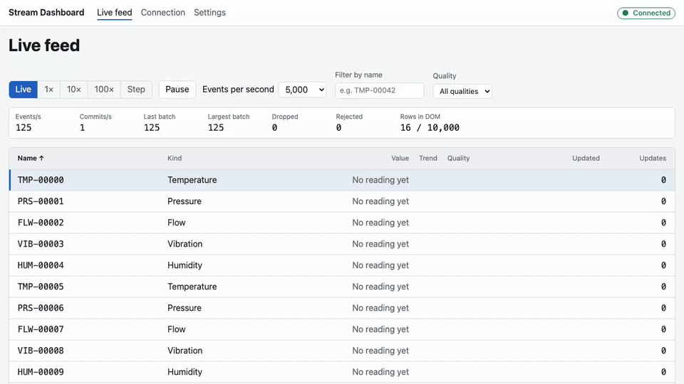
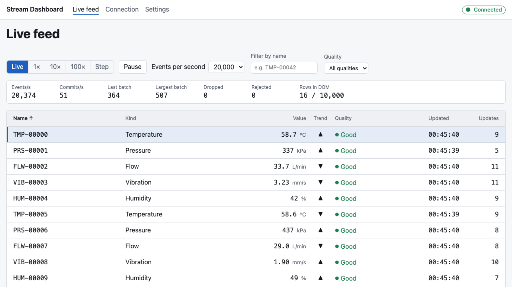
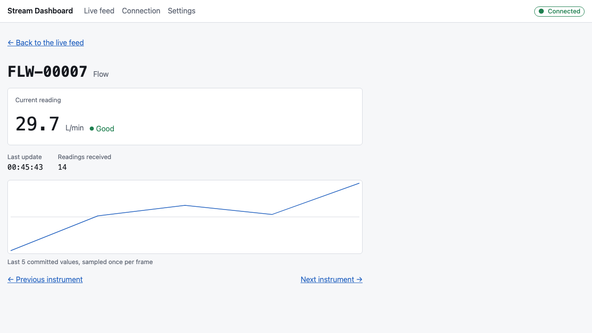
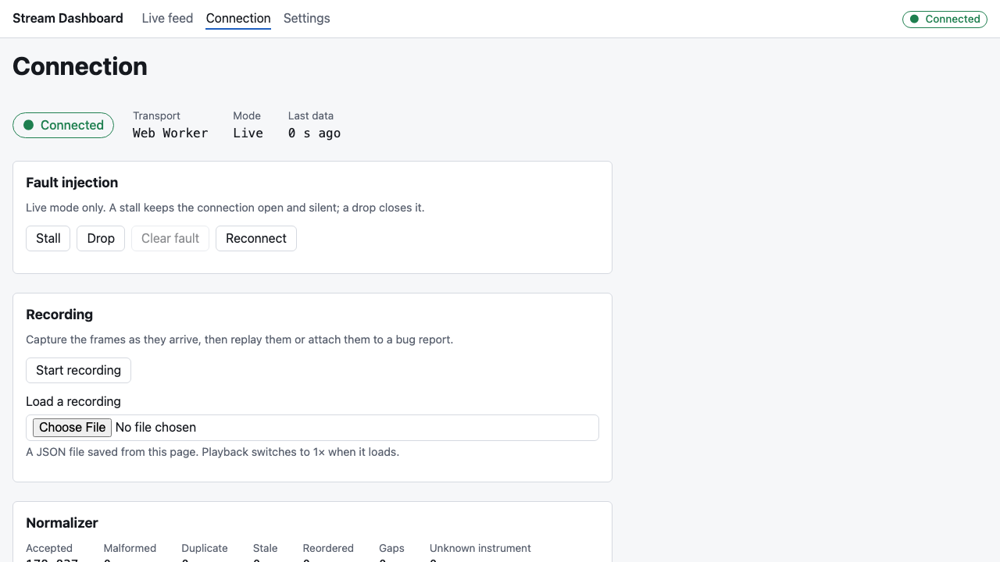
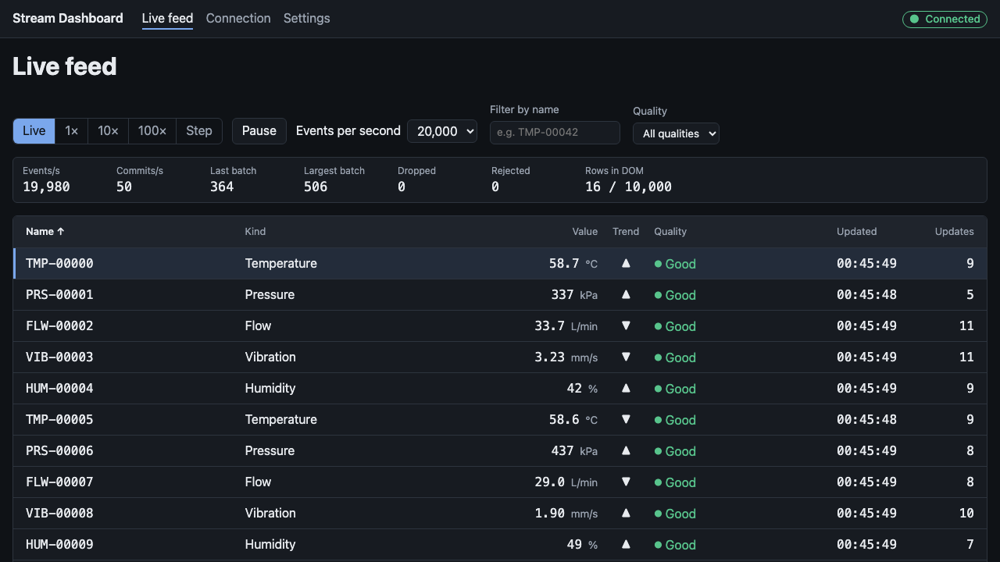
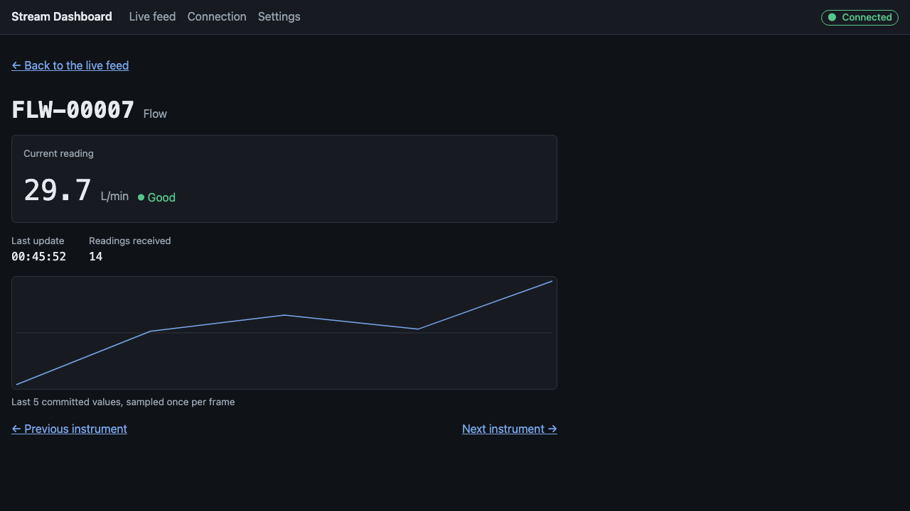
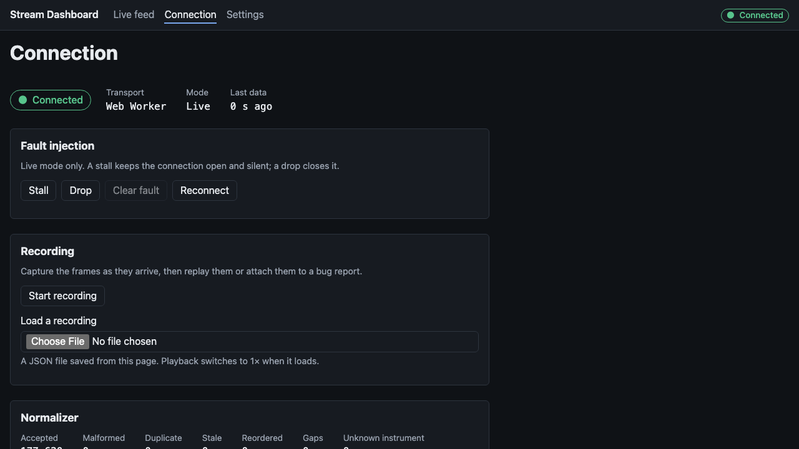

# vue-stream-dashboard

A realtime dashboard built on one rule: **high-frequency data should not
directly drive the Vue render loop.**

[](https://github.com/mykolapodpriatov/vue-stream-dashboard/actions/workflows/ci.yml)


[](./LICENSE)



**[Live demo](https://mykolapodpriatov.github.io/vue-stream-dashboard/) ·
[Architecture](./ARCHITECTURE.md) · [Decisions](./docs/adr) ·
[Quick start](#quick-start)**

---

## Why this exists

Every realtime Vue dashboard starts the same way: a socket handler that
writes to a `ref`. It works at ten events a second. At ten thousand, Vue
spends the frame notifying dependents and scheduling jobs, the table stutters,
and the fix people reach for — throttling, `v-memo`, a bigger machine — treats
the symptom.

The cause is architectural: **the event rate is driving the render loop.**
This repository takes the position that it never should, and builds the whole
application around one path:

```
incoming events → normalizer → ring buffer → requestAnimationFrame
    → batched snapshot → shallowRef → visible window → DOM
```

Events go into a ring buffer as they arrive. Once per animation frame the
buffer is drained, the batch is applied to plain objects, and **one**
`shallowRef` is assigned. That is the only reactive write in the system, and
it happens at most 60 times a second regardless of the event rate.
([ADR-001](./docs/adr/001-frame-batched-commits.md))

Everything else in the repository exists to support, test or make visible that
one decision.

## What it demonstrates

|                      | What                                                                                                                                                                                         | Where                                                                                                                              |
| -------------------- | -------------------------------------------------------------------------------------------------------------------------------------------------------------------------------------------- | ---------------------------------------------------------------------------------------------------------------------------------- |
| **Pipeline**         | normalizer as trust boundary · drop-oldest ring buffer · rAF batcher · snapshot as version marker, not a copy                                                                                | `src/pipeline/` · [ADR-002](./docs/adr/002-snapshot-is-a-version-marker.md)                                                        |
| **Sources**          | one `StreamSource<T>` interface · seeded generator in a Web Worker · replay at `1× · 10× · 100× · step` · recordings you can download and reload · fault injection (stall, drop)             | `src/sources/` · [ADR-003](./docs/adr/003-one-source-interface-with-replay.md)                                                     |
| **Virtual grid**     | 10 000 rows, ~20 in the DOM · `role="grid"` with `aria-rowcount` / `aria-rowindex` · arrow-key navigation via `aria-activedescendant` · and a written line for when to use a library instead | `src/components/virtual/` · [docs/virtualization.md](./docs/virtualization.md) · [ADR-005](./docs/adr/005-own-the-virtual-list.md) |
| **Performance gate** | structural invariants in CI — rows ≤ 80, commits ≤ frames — and milliseconds as an artifact, never a gate                                                                                    | `e2e/invariants.spec.ts` · `bench/` · [ADR-004](./docs/adr/004-structural-invariants-not-milliseconds.md)                          |
| **Accessibility**    | state as words, then shape, then colour · one live region · skip link · axe on every screen in both themes and both languages                                                                | `e2e/accessibility.spec.ts`                                                                                                        |
| **i18n / themes**    | English and Russian with a type-checked message schema · light, dark and system                                                                                                              | `src/i18n/` · `src/assets/tokens.css`                                                                                              |

## Measured

Chromium, four seconds at **20 000 events/s**, 10 000 instruments
(`pnpm run bench`; the CI `benchmark` job publishes the runner's numbers on
every push):

| Metric                         | Value              |
| ------------------------------ | ------------------ |
| Events applied per second      | 19 986             |
| Snapshot commits per second    | 50                 |
| Rows in the DOM                | 16                 |
| Frame interval p50 / p95 / max | 8.3 / 9.2 / 9.4 ms |
| Frames over 34 ms              | 0                  |
| JS heap                        | 17 MB              |

The gate is not these numbers. CI asserts the _shape_: ten thousand rows
never put more than 80 in the DOM; in any window, commits never outnumber
animation frames; a one-second backlog lands in at most three commits. Those
hold on a slow runner exactly as on a fast one, because they count rather than
time.

## Screens

| Live feed                             | Instrument                             | Connection                             |
| ------------------------------------- | -------------------------------------- | -------------------------------------- |
|  |  |  |
|   |   |   |

- **Live feed** — playback mode, pause, rate, name and quality filters, the
  stats that make the thesis visible, and the table.
- **Instrument** — current reading, quality, a canvas sparkline sampled once
  per frame from the same snapshot the table renders.
- **Connection** — status as a word, fault injection, record → download →
  reload, and the normalizer's reasons for rejecting frames.
- **Settings** — theme, language, fleet size, rate, seed, and a _dirty wire_
  switch that injects duplicates, reorders, `NaN` and unknown codes so the
  normalizer has something to reject.

## Quick start

```bash
corepack enable
pnpm install
pnpm dev
```

No backend. The live source is a Web Worker running a seeded generator, so
the same seed produces the same fleet on every machine.

```bash
pnpm run verify     # lint + typecheck + unit tests + build — what CI runs
pnpm run test:e2e   # Playwright against the production build
pnpm run bench      # frame timing at 20k events/s → bench-results/
```

## Design notes

**A source is an `AsyncIterable` of batches.** Pull semantics make `step`
mode fall out of the interface — a consumer that does not call `next()` gets
nothing — and give cancellation a defined meaning. It yields batches because a
promise per event at 10k/s is the wrong shape. It is not called `EventSource`
because the DOM already has one.

**The snapshot is not a copy.** Rows are stable, mutable, non-reactive
objects; the snapshot is a new wrapper around the same array so the
`shallowRef` triggers. Components read rows only during render, render runs
only on commit, and a commit happens only after the batch is fully applied —
so no render observes a half-applied frame, and no frame budget goes to
copying ten thousand rows.

**Recordings are the unit of reproducibility.** Attach one to a bug report
and the dashboard can be put into the state that produced it. The bundled demo
recording is _generated_ from a seed rather than checked in — the generator is
deterministic, so a seed and a duration describe it completely.

**The stall is the failure that matters.** A drop is honest: the connection
closes, the status says Offline. A stall — a peer that vanished without a
close frame — keeps saying Connected while the data quietly stops being new.
The connection page lets you inject both. Detecting the stall is the job of
the [composables kit](https://github.com/mykolapodpriatov/vue-composables-kit)'s
`useEventStream` watchdog, which is this repository's designed next step.

**Sorting is the most expensive thing per frame,** and it says so. It sorts an
index array, never the rows; the default order is the identity and skips it.

## What is deliberately not here

A charting library. A general virtualizer (see
[docs/virtualization.md](./docs/virtualization.md) for exactly where the line
is). A real backend. Persistence. Per-event history. Each is a real thing real
dashboards need, and each would move the repository's centre of gravity away
from the one idea it exists to show.

## Related

- [`vue-composables-kit`](https://github.com/mykolapodpriatov/vue-composables-kit)
  — the async-lifecycle composables this dashboard is designed to consume
  (`useEventStream`, `lazyImport`, `useLocalStorage`).
- [`nuxt-drupal-starter`](https://github.com/mykolapodpriatov/nuxt-drupal-starter)
  — production-grade decoupled Drupal front end on Nuxt 4.

## License

[MIT](./LICENSE)
